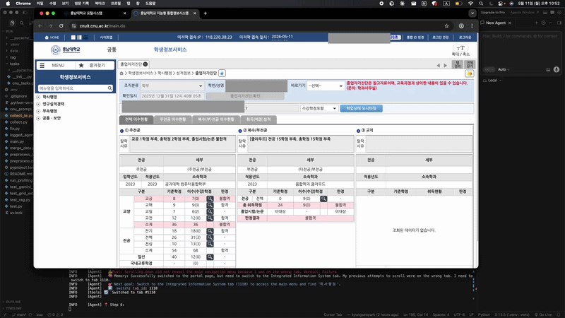

# BUA Project

충남대학교 통합정보시스템 자동화 에이전트 모델 테스트 레포지토리입니다.

## 데모 (Demo)
<!-- 아래 줄에 GIF 파일을 드래그 앤 드롭 하시면 자동으로 링크가 채워집니다! -->


## 개요

이 레포지토리는 파인튜닝된 Qwen2.5-VL 모델을 기반으로 충남대학교 통합정보시스템(cnuit.cnu.ac.kr)을 자동으로 탐색하고 작업을 수행하는 Browser-Use 에이전트를 테스트하기 위한 임시 레포지토리입니다.

> ⚠️ **현재 모델 파인튜닝이 진행 중입니다. 임시(Temp) 레포지토리로 간주해주세요.**

## 환경 설정

### 1. 패키지 설치

```bash
git clone [https://github.com/kyungseopark/BUA_project.git](https://github.com/kyungseopark/BUA_project.git)
cd BUA_project
uv sync